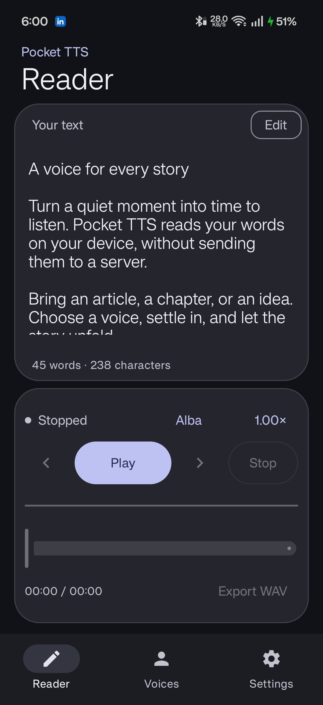
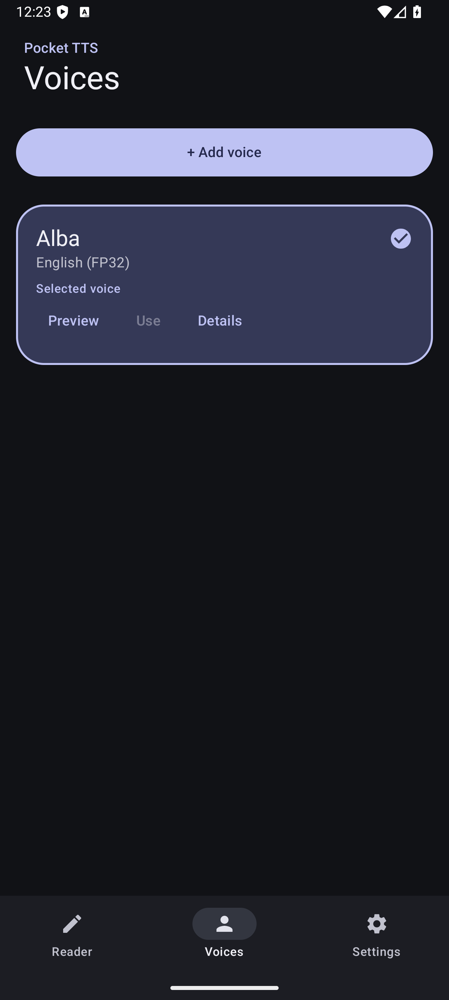
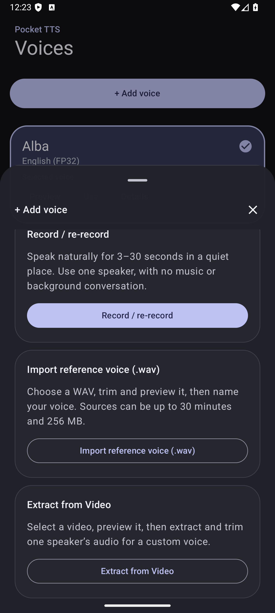
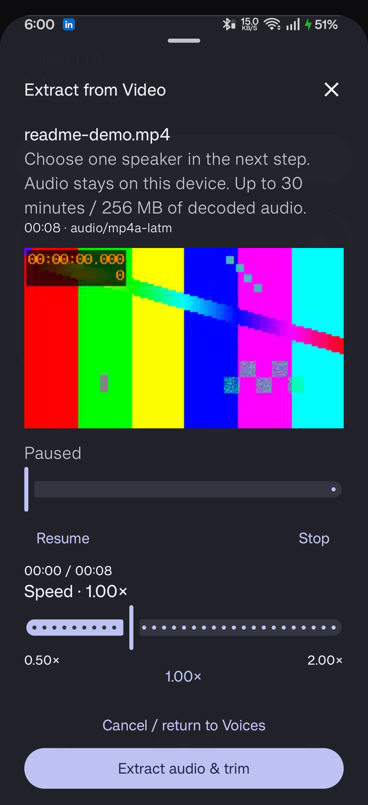
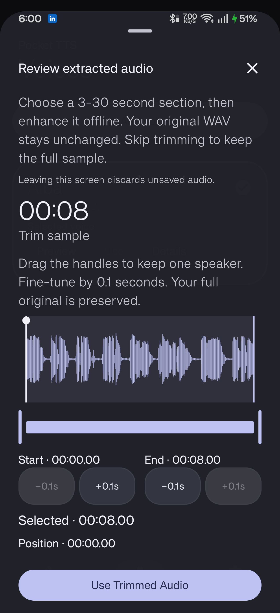
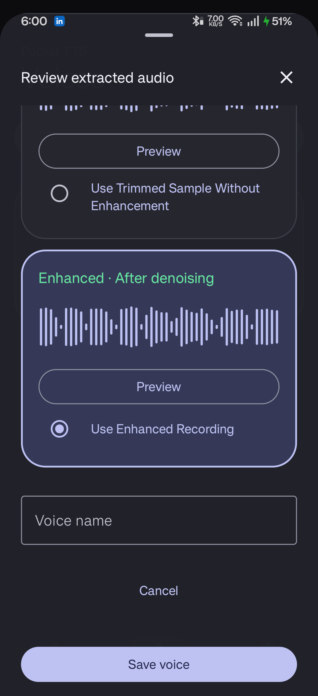
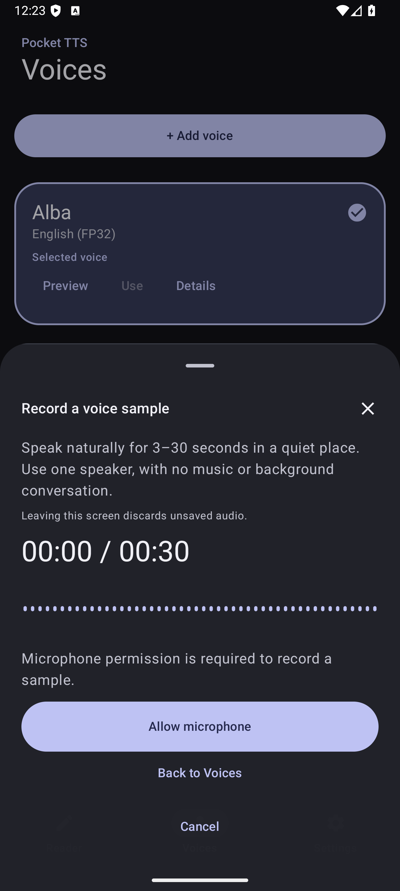
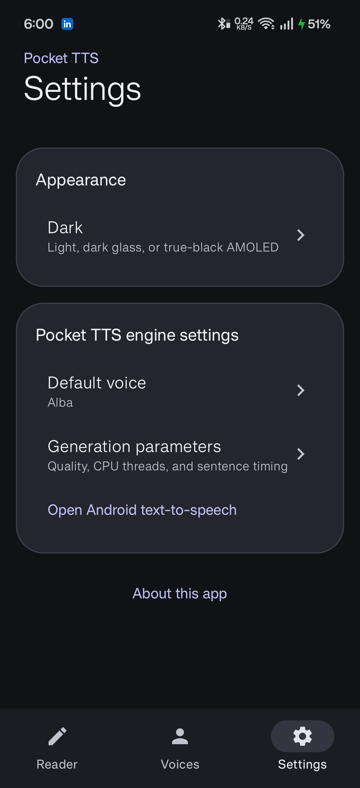
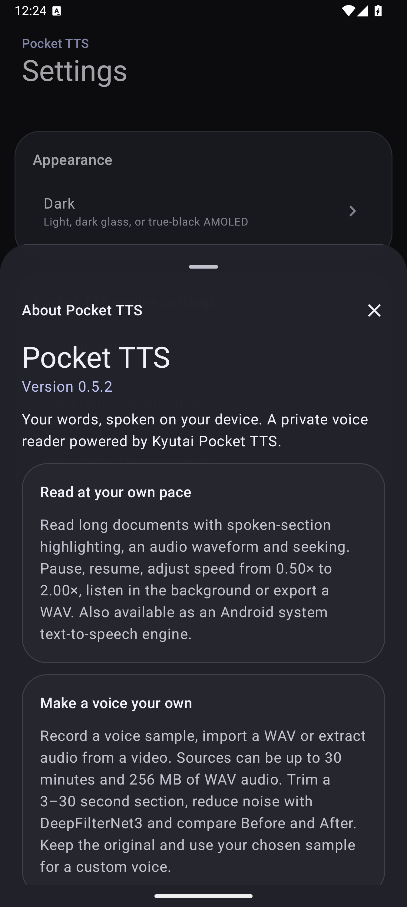

# Pocket TTS for Android

Offline text-to-speech, a long-form Reader, and custom voices made from your own audio.

Pocket TTS brings Kyutai's Pocket TTS to Android using native ONNX inference. Read documents aloud, control playback from Android's media notification, and create a voice reference from a recording, WAV file, or video's audio—all on your device.

This is an unofficial community application, not an official Kyutai release.

**Requirements:** Android 8.0 or newer, ARM64. The English FP32 model and Alba voice are bundled; no model download is required after installation.

## Features

### Read and listen

- A spacious, scrollable Reader with read-only and editing modes.
- Automatic text chunking, spoken-section highlighting, and scroll following. Highlighting follows speech sections, not individual word timings.
- Compact controls for play, pause/resume, stop, previous/next chunk, waveform seeking, voice selection, and playback speed from **0.50× to 2.00×**.
- Background playback with Android media-session and notification controls.
- Export a completed reading as WAV audio.
- Android system text-to-speech engine support for compatible apps.

### Create and manage voices

- Record with live microphone-amplitude feedback, import WAV audio, or **Extract from Video**.
- Trim a reference using waveform handles, preview seeking, and 0.1-second adjustments.
- Apply bundled **DeepFilterNet3** noise reduction and compare Before/After audio. You can keep the unenhanced sample.
- Preview, select, rename, edit, and delete custom voices. Saved edits preserve the original reference for **Restore Original**.
- Adjust reference volume from **50–200%**, with peak limiting to prevent clipping.
- Export an accepted reference as WAV, or back up all custom voices in a portable ZIP.

Voice cloning conditions the existing model on reference audio; it does not train a new model. Only use recordings you have permission to use.

### Appearance

- Material 3 with restrained glass-style surfaces, rounded geometry, and muted periwinkle accents.
- System, Light, Dark, and AMOLED modes.
- Bottom sheets that resist short dismissal swipes, and grouped voice-action menus with subtle separators.

## Install and get started

Check [GitHub Releases](https://github.com/Rafin14/PocketTTS/releases) for APK availability and release-specific notes, or [build from source](docs/BUILDING.md).

1. Install an ARM64 APK and open **Pocket TTS**.
2. Allow the bundled model and Alba reference to prepare in local storage.
3. Open **Reader → Edit**, type or paste text, and press **Play**.
4. Open **Voices → Add voice** to record, import a WAV, or extract video audio.
5. Use **Settings** to change appearance, generation settings, or export/import voice backups.

For other apps, select Pocket TTS in Android's **Text-to-speech output** settings. The settings location varies by device.

APK updates must use the same signing identity as the installed app. Before uninstalling or changing signing keys, [export your custom voices](docs/VOICE_BACKUP.md) and copy any Reader text you want to keep. Uninstalling removes app-private data.

## Screenshots

App captures from an Android 16 ARM64 phone. The video example uses an attributed Alba reference and a generated test picture; no personal recordings are shown. These captures predate the compact-player and overflow-menu refinements, so current spacing and menu appearance may differ.

<table>
<tr>
<td align="center"><br>Focused Reader</td>
<td align="center"><br>Voice selection</td>
<td align="center"><br>Record, import, or extract</td>
</tr>
<tr>
<td align="center"><br>Video-to-voice</td>
<td align="center"><br>Precise sample trimming</td>
<td align="center"><br>Before/after enhancement</td>
</tr>
<tr>
<td align="center"><br>Voice recording</td>
<td align="center"><br>Settings</td>
<td align="center"><br>About</td>
</tr>
</table>

## Privacy and responsible use

The app has **no INTERNET permission**. Speech generation, voice conditioning, noise reduction, and video-audio extraction run locally. Models are packaged with the app, and Android backup is disabled for app data.

Android's document picker may expose cloud-backed providers that download or sync selected files independently. Exported files go to the destination you choose. Voice-backup ZIPs contain recordings and **are not encrypted**; store and share them carefully. Review diagnostic logs before sharing them.

Do not clone voices without permission or present generated speech as an authentic recording of someone else. Source-code, model, and recording licenses are separate; see the attribution links below.

## Limits and compatibility

- English FP32 is bundled; the app does not offer downloadable language packs.
- Native speech generation requires ARM64. x86 emulator translation is not supported for Pocket TTS inference.
- Source audio: up to **30 minutes** and **256 MiB of decoded WAV data**. This is not a compressed-video file-size cap.
- Microphone recordings and selected enhancement references: **3–30 seconds**.
- Video support depends on Android's installed decoders. Protected, corrupt, unsupported, or non-seekable inputs may be rejected.
- Noise reduction cannot reliably remove music, echo, or other speakers. Use clean, single-speaker references when possible.
- Allow approximately **420 MiB** for extracted Pocket assets in addition to the APK, generated speech, recordings, and temporary files. Performance and voice quality vary by hardware and sample quality.

## Documentation

| Guide | Topics |
| --- | --- |
| [Reader](docs/READER.md) | Editing, playback, chunk navigation, seeking, and WAV export |
| [Voice management](docs/PLAYBACK_AND_VOICE_EDITING.md) | Selection, previews, saved-reference edits, and restoration |
| [Trimming and speed](docs/TRIMMING_AND_SPEED.md) | Selection, volume, supported WAV formats, and playback rate |
| [Extract from Video](docs/VIDEO_VOICES.md) | Video import, decoding, and reference creation |
| [Noise reduction](docs/DEEPFILTER.md) | DeepFilterNet3 behavior, limitations, and provenance |
| [Voice backup](docs/VOICE_BACKUP.md) | Exports, restoration, compatibility, and privacy |
| [Appearance and Reader modes](docs/READER_MODES_AND_ABOUT.md) | Themes, scrolling behavior, and About |
| [Audio limits and accessibility](docs/LIMITS_AND_UI_AUDIT.md) | Input limits, responsive layout, and accessibility |
| [Building and testing](docs/BUILDING.md) | Command-line/Android Studio setup, device checks, and signing |
| [Publishing](docs/PUBLISHING_CHECKLIST.md) | Source review, Git LFS, and APK release checklist |

## Build from source

Use JDK 17 or JBR 21, Android SDK Platform 35, NDK 27.2.12479018, and CMake 3.22.1. Git LFS is required for the model archive. Native dependency preparation needs Bash, curl, unzip, tar, and sha256sum. Initial dependency downloads require internet access; normal app operation does not.

```bash
git lfs install
git clone https://github.com/Rafin14/PocketTTS.git
cd PocketTTS
git lfs pull
bash scripts/prepare_android_native_deps.sh
./gradlew :app:assembleDebug
```

On Windows, prepare native dependencies in an equipped Bash/WSL environment, then run `.\gradlew.bat :app:assembleDebug` from PowerShell at the repository root. Configure `JAVA_HOME` and your Android SDK as described in the [build guide](docs/BUILDING.md).

Output: `app/build/outputs/apk/debug/app-debug.apk`. Android Studio is optional; to use it, open the repository root, sync Gradle, and run the `app` configuration on an ARM64 device.

The required `PocketTTS-english-FP32.zip` is approximately **198 MiB** and uses Git LFS. DeepFilter's approximately 8.2 MiB ONNX asset is included normally. Keep the required models, tokenizer, voices, and notices when building or redistributing the app.

## Development

The app uses Kotlin, Jetpack Compose, Material 3, and an embedded Android text editor. `ReaderPlaybackService` owns Reader audio and its media session; `SamplePreview` handles foreground sample/video previews. `ModelPackRepository` manages voice metadata and references. JNI connects PocketTTS.cpp and the DeepFilter DSP to ONNX Runtime.

```bash
./gradlew :app:assembleDebug :app:testDebugUnitTest :app:lintDebug
python scripts/check_publishable.py
```

Use a dedicated [QA installation](docs/BUILDING.md#isolated-device-testing) for instrumentation. Tests may change settings and create/delete test voices. Emulator UI checks and generated-WAV fixtures do not establish native synthesis performance or speech quality; test those on ARM64 hardware.

Contributions are welcome. See [Contributing](CONTRIBUTING.md) for pull-request guidance and [Security](SECURITY.md) for privacy or security reports.

## Licenses and attribution

Application code: [MIT](LICENSE). Vendored software retains its original notices.

- Pocket TTS and PocketTTS.cpp code: MIT. Converted Pocket model and Alba voice have separate CC BY 4.0 attribution/use conditions; see [model license](MODEL_LICENSE.md) and [voice attribution](VOICE_ATTRIBUTION.md).
- DeepFilterNet3 model: MIT; adapted speech-core DSP/resampler: Apache-2.0; KissFFT: BSD-3-Clause.
- ONNX Runtime: MIT; SentencePiece, AndroidX/Compose and Kotlin: Apache-2.0; dr_libs offers public-domain/MIT-0 licensing.
- Full notices, pinned provenance, modifications and bundled license texts: [Third-party notices](THIRD_PARTY_NOTICES.md), [packaged licenses](app/src/main/assets/licenses/), [DeepFilter notices](app/src/main/assets/deepfilter/NOTICES.txt).

Upstream software, models and recordings retain their original copyright notices and licensing requirements.
